# Fleet Management Module — Database Schema

**System:** AgriGEN ERP — Fleet Management  
**Last Updated:** 2026-04-13  
**Module Version:** Post-Workshop Integration (v2)

---

## Table of Contents

1. [Schema Change Log](#schema-change-log)
2. [Module Overview](#module-overview)
3. [External Dependencies](#external-dependencies)
4. [ER Diagram](#er-diagram)
5. [Table Definitions](#table-definitions)
   - [Master / Lookup Tables](#master--lookup-tables)
   - [Vehicle Core](#vehicle-core)
   - [Driver & Operations](#driver--operations)
   - [Workshop & Technicians](#workshop--technicians)
   - [Maintenance & Service](#maintenance--service)
   - [Inventory (Workshop)](#inventory-workshop)
6. [Audit Columns (All Tables)](#audit-columns-all-tables)
7. [Soft Delete Policy](#soft-delete-policy)

---

## Schema Change Log

> Changes from the **initial v1 design** are marked below. All tables additionally received the five audit columns described in [§ Audit Columns](#audit-columns-all-tables).

| # | Table | Change Type | Detail |
|---|-------|-------------|--------|
| 1 | `MaintenanceTask` | **ADDED column** | `TaskType VARCHAR(20) NOT NULL` — discriminator `'Vehicle Service'` \| `'Maintenance'`. Controls which child screen (VehicleService vs MaintenanceRecord) may attach records to this task. |
| 2 | `MaintenanceRecord` | **ADDED column** | `MaintenanceTaskID INT NOT NULL FK` — record now requires a parent task. Previously stand-alone. |
| 3 | `MaintenanceRecord` | **ADDED column** | `WorkshopID INT NOT NULL FK` — denormalized from parent task for query performance. |
| 4 | `MaintenanceRecordItem` | **NEW TABLE** | SKU/parts line items for maintenance records. Mirrors `VehicleServiceItem`. Includes stock source tracking and removed-parts return fields. |
| 5 | `VehicleService` | **CHANGED constraint** | `MaintenanceTaskID` was `NULL`-able (optional link); now `NOT NULL` (required). A vehicle service record cannot exist without a parent `'Vehicle Service'` type task. |
| 6 | `VehicleServiceItem` | **ADDED columns** | `Source`, `ItemIssueRef`, `HasRemovedItem`, `RemovedSKUID`, `RemovedQuantity`, `RemovedUnitCost` — to track whether parts came from Workshop stock or direct Item Issue, and to capture removed/replaced parts returned to workshop stock. |
| 7 | `WorkshopStock` | **Behaviour change** | Balance is now automatically decremented when `VehicleService` or `MaintenanceRecord` items with `Source = 'Workshop'` are saved, and incremented when `HasRemovedItem = true` (returned part enters workshop stock). |
| 8 | **ALL tables** | **ADDED columns ×5** | `IsActive`, `CreatedBy`, `CreatedDate`, `ModifiedBy`, `ModifiedDate` — see [§ Audit Columns](#audit-columns-all-tables). |

---

## Module Overview

```
Fleet Management
├── Master / Lookup
│   ├── Group                   (plantation holding company)
│   ├── Estate                  (estate within a group)
│   ├── VehicleType
│   ├── FixedAssetType
│   ├── FuelType                (links to SKUMaster in Inventory module)
│   ├── DocumentType
│   ├── PurposeCategory
│   └── LicenseCategory
│
├── Vehicle Core
│   ├── Vehicle
│   ├── VehicleDocument
│   └── VehiclePurposeMapping
│
├── Driver & Operations
│   ├── Driver                  (links to Employee in HR module)
│   ├── DriverAssignment
│   └── DailyRunning
│
├── Workshop & Technicians
│   ├── Workshop
│   ├── TechCategory
│   ├── TechAssignment          (links to Employee in HR module)
│   └── WorkshopTechRate
│
├── Maintenance & Service
│   ├── MaintenanceTask         ← parent for all workshop activity
│   ├── JobCard
│   ├── MaintenanceRecord       + MaintenanceRecordItem  [NEW relationship]
│   └── VehicleService          + VehicleServiceItem     [extended]
│
└── Inventory (Workshop)
    ├── ItemIssue               + ItemIssueItem
    └── WorkshopStock           (FIFO balance per workshop per SKU)

External (AgriGEN ERP, read-only in Fleet module)
    ├── Employee                (HR module)
    └── SKUMaster               (Inventory module)
```

---

## External Dependencies

| External Table | Owned By | Used In Fleet Module For |
|----------------|----------|--------------------------|
| `Employee` | AgriGEN HR | Drivers, Technicians (`employeeID` FK) |
| `SKUMaster` | AgriGEN Inventory | Parts/lubricants used in service items |

These tables are **read-only references** in the Fleet module. No audit columns are added to them here.

---

## ER Diagram

```mermaid
erDiagram

    %% ── External References ──────────────────────────────────────────
    Employee {
        int     EmployeeID PK
        string  EmployeeNo
        string  Name
        int     EstateID
        int     GroupID
    }
    SKUMaster {
        int     SKUID PK
        string  Code
        string  Name
        string  Unit
    }

    %% ── Master / Lookup ──────────────────────────────────────────────
    Group {
        int     GroupID PK
        string  Name
    }
    Estate {
        int     EstateID PK
        string  Name
        int     GroupID FK
    }
    VehicleType {
        int     VehicleTypeID PK
        string  Code
        string  Name
        int     GroupID FK
    }
    FixedAssetType {
        int     FixedAssetTypeID PK
        string  Code
        string  Name
        int     GroupID FK
        int     EstateID FK
    }
    FuelType {
        int     FuelTypeID PK
        string  Code
        string  Name
        bool    IsSecondary
        int     GroupID FK
        int     SKUMasterID FK
    }
    DocumentType {
        int     DocumentTypeID PK
        string  Code
        string  Name
        bool    ExpirationEnabled
        int     GroupID FK
    }
    PurposeCategory {
        int     PurposeCategoryID PK
        string  Code
        string  Name
        string  Module
        int     GroupID FK
    }
    LicenseCategory {
        int     LicenseCategoryID PK
        string  Code
        string  Name
        int     GroupID FK
    }
    TechCategory {
        int     TechCategoryID PK
        string  Code
        string  Name
    }

    %% ── Vehicle Core ─────────────────────────────────────────────────
    Vehicle {
        int     VehicleID PK
        string  Numbers
        string  Brand
        string  Model
        int     GroupID FK
        int     EstateID FK
        int     VehicleTypeID FK
        int     FixedAssetTypeID FK
        int     FuelTypeID FK
        string  RegisterYear
        string  Capacity
        decimal CostOfAsset
        int     UsefulLifeYears
        decimal ResidualValue
        decimal DepreciationValue
        string  Status
    }
    VehicleDocument {
        int     VehicleDocumentID PK
        int     VehicleID FK
        int     DocumentTypeID FK
        string  DocNumber
        date    StartDate
        date    ExpireDate
        string  Notes
    }
    VehiclePurposeMapping {
        int     MappingID PK
        int     VehicleID FK
        int     PurposeCategoryID FK
        date    EffectiveDate
        string  Notes
    }

    %% ── Driver & Operations ──────────────────────────────────────────
    Driver {
        int     DriverID PK
        string  Code
        int     EmployeeID FK
        string  Name
        string  LicenseNo
        int     LicenseCategoryID FK
        date    LicExpireDate
        string  Status
        string  Notes
    }
    DriverAssignment {
        int     AssignmentID PK
        int     VehicleID FK
        int     DriverID FK
        date    StartDate
        date    EndDate
        string  Notes
    }
    DailyRunning {
        int     DailyRunningID PK
        string  RefCode
        int     VehicleID FK
        int     DriverID FK
        datetime StartDateTime
        datetime EndDateTime
        int     StartOdo
        int     EndOdo
        string  Notes
    }

    %% ── Workshop & Technicians ───────────────────────────────────────
    Workshop {
        int     WorkshopID PK
        string  Code
        string  Name
        int     GroupID FK
        int     EstateID FK
        string  Status
    }
    TechAssignment {
        int     TechAssignmentID PK
        int     EmployeeID FK
        int     TechCategoryID FK
        string  Notes
    }
    WorkshopTechRate {
        int     WorkshopTechRateID PK
        string  Code
        int     WorkshopID FK
        int     TechCategoryID FK
        string  RateType
        decimal RateAmount
    }

    %% ── Maintenance & Service ────────────────────────────────────────
    MaintenanceTask {
        int     MaintenanceTaskID PK
        string  RefCode
        date    Date
        int     VehicleID FK
        int     WorkshopID FK
        string  Mode
        string  TaskType
        decimal CostTotal
        string  Notes
    }
    JobCard {
        int     JobCardID PK
        int     MaintenanceTaskID FK
        int     VehicleID FK
        int     WorkshopID FK
        int     EmployeeID FK
        datetime StartTime
        datetime EndTime
        string  Description
        decimal CostOfService
    }
    MaintenanceRecord {
        int     MaintenanceRecordID PK
        int     MaintenanceTaskID FK
        int     VehicleID FK
        int     WorkshopID FK
        date    Date
        decimal CostOfService
        string  Description
    }
    MaintenanceRecordItem {
        int     ItemID PK
        int     MaintenanceRecordID FK
        int     SKUID FK
        decimal Quantity
        decimal UnitCost
        string  Source
        string  ItemIssueRef
        bool    HasRemovedItem
        int     RemovedSKUID FK
        decimal RemovedQuantity
        decimal RemovedUnitCost
    }
    VehicleService {
        int     VehicleServiceID PK
        int     MaintenanceTaskID FK
        int     VehicleID FK
        int     WorkshopID FK
        date    ServiceDate
        int     Odometer
        date    NextServiceDate
        int     NextServiceOdo
        decimal CostAmount
        string  Notes
    }
    VehicleServiceItem {
        int     ItemID PK
        int     VehicleServiceID FK
        int     SKUID FK
        decimal Quantity
        decimal UnitCost
        string  Source
        string  ItemIssueRef
        bool    HasRemovedItem
        int     RemovedSKUID FK
        decimal RemovedQuantity
        decimal RemovedUnitCost
    }

    %% ── Inventory (Workshop) ─────────────────────────────────────────
    ItemIssue {
        int     ItemIssueID PK
        string  RefCode
        date    IssueDate
        string  IssueType
        int     TargetID
        string  Notes
    }
    ItemIssueItem {
        int     ItemID PK
        int     ItemIssueID FK
        int     SKUID FK
        decimal Quantity
        decimal UnitCost
    }
    WorkshopStock {
        int     WorkshopStockID PK
        int     WorkshopID FK
        int     SKUID FK
        decimal Balance
        decimal UnitCost
    }

    %% ── Relationships ────────────────────────────────────────────────
    Group         ||--o{ Estate                 : "has"
    Group         ||--o{ VehicleType            : "scoped to"
    Group         ||--o{ FixedAssetType         : "scoped to"
    Group         ||--o{ FuelType               : "scoped to"
    Group         ||--o{ DocumentType           : "scoped to"
    Group         ||--o{ PurposeCategory        : "scoped to"
    Group         ||--o{ LicenseCategory        : "scoped to"
    Group         ||--o{ Vehicle                : "owns"
    Group         ||--o{ Workshop               : "owns"
    Estate        ||--o{ Vehicle                : "hosts"
    Estate        ||--o{ Workshop               : "hosts"
    Estate        ||--o{ FixedAssetType         : "scoped to"

    VehicleType      ||--o{ Vehicle             : "classifies"
    FixedAssetType   ||--o{ Vehicle             : "asset type"
    FuelType         ||--o{ Vehicle             : "uses"
    SKUMaster        ||--o{ FuelType            : "links to"

    Vehicle       ||--o{ VehicleDocument        : "has"
    DocumentType  ||--o{ VehicleDocument        : "type of"
    Vehicle       ||--o{ VehiclePurposeMapping  : "mapped to"
    PurposeCategory ||--o{ VehiclePurposeMapping : "used for"

    Employee      ||--o{ Driver                 : "registered as"
    LicenseCategory ||--o{ Driver               : "holds"
    Driver        ||--o{ DriverAssignment       : "assigned via"
    Vehicle       ||--o{ DriverAssignment       : "has driver"
    Vehicle       ||--o{ DailyRunning           : "logged in"
    Driver        ||--o{ DailyRunning           : "drives"

    Employee      ||--o{ TechAssignment         : "assigned as"
    TechCategory  ||--o{ TechAssignment         : "category"
    TechCategory  ||--o{ WorkshopTechRate       : "rated under"
    Workshop      ||--o{ WorkshopTechRate       : "rates"

    Vehicle       ||--o{ MaintenanceTask        : "undergoes"
    Workshop      ||--o{ MaintenanceTask        : "handles"
    MaintenanceTask ||--o{ JobCard              : "has"
    Workshop      ||--o{ JobCard               : "raised at"
    Employee      ||--o{ JobCard               : "assigned to"

    MaintenanceTask ||--o{ MaintenanceRecord    : "parent of"
    Vehicle       ||--o{ MaintenanceRecord      : "recorded for"
    Workshop      ||--o{ MaintenanceRecord      : "at"
    MaintenanceRecord ||--o{ MaintenanceRecordItem : "uses parts"
    SKUMaster     ||--o{ MaintenanceRecordItem  : "part ref"
    SKUMaster     ||--o{ MaintenanceRecordItem  : "removed part ref"

    MaintenanceTask ||--o{ VehicleService       : "parent of"
    Vehicle       ||--o{ VehicleService         : "serviced"
    Workshop      ||--o{ VehicleService         : "at"
    VehicleService ||--o{ VehicleServiceItem    : "uses parts"
    SKUMaster     ||--o{ VehicleServiceItem     : "part ref"
    SKUMaster     ||--o{ VehicleServiceItem     : "removed part ref"

    Workshop      ||--o{ ItemIssue              : "received by"
    ItemIssue     ||--o{ ItemIssueItem          : "contains"
    SKUMaster     ||--o{ ItemIssueItem          : "item ref"
    Workshop      ||--o{ WorkshopStock          : "holds"
    SKUMaster     ||--o{ WorkshopStock          : "stocked as"
```



---

## Table Definitions

> **Audit columns** (`IsActive`, `CreatedBy`, `CreatedDate`, `ModifiedBy`, `ModifiedDate`) are present on every table listed below. They are shown in the [Audit Columns section](#audit-columns-all-tables) and **omitted from individual table grids** for brevity — but must be included in every physical table.
>
> `🆕` = new column added in v2 change   `🔄` = changed from v1

---

### Master / Lookup Tables

#### `Group`
| Column | Type | Constraints | Description |
|--------|------|-------------|-------------|
| GroupID | INT | PK, AUTO | Plantation holding company |
| Name | NVARCHAR(150) | NOT NULL, UNIQUE | Company name |

#### `Estate`
| Column | Type | Constraints | Description |
|--------|------|-------------|-------------|
| EstateID | INT | PK, AUTO | |
| Name | NVARCHAR(150) | NOT NULL | Estate name |
| GroupID | INT | FK → Group | Owning group |

#### `VehicleType`
| Column | Type | Constraints | Description |
|--------|------|-------------|-------------|
| VehicleTypeID | INT | PK, AUTO | |
| Code | VARCHAR(10) | NOT NULL, UNIQUE | e.g. VT001 |
| Name | NVARCHAR(100) | NOT NULL | e.g. Heavy Truck |
| Desc | NVARCHAR(255) | NULL | |
| GroupID | INT | FK → Group | |

#### `FixedAssetType`
| Column | Type | Constraints | Description |
|--------|------|-------------|-------------|
| FixedAssetTypeID | INT | PK, AUTO | |
| Code | VARCHAR(10) | NOT NULL, UNIQUE | e.g. FA001 |
| Name | NVARCHAR(100) | NOT NULL | |
| Desc | NVARCHAR(255) | NULL | |
| GroupID | INT | FK → Group | |
| EstateID | INT | FK → Estate | |

#### `FuelType`
| Column | Type | Constraints | Description |
|--------|------|-------------|-------------|
| FuelTypeID | INT | PK, AUTO | |
| Code | VARCHAR(10) | NOT NULL, UNIQUE | e.g. DSL |
| Name | NVARCHAR(100) | NOT NULL | |
| IsSecondary | BIT | NOT NULL, DEFAULT 0 | Secondary / alternative fuel |
| GroupID | INT | FK → Group | |
| SKUMasterID | INT | FK → SKUMaster (Ext) | Links fuel type to inventory SKU |

#### `DocumentType`
| Column | Type | Constraints | Description |
|--------|------|-------------|-------------|
| DocumentTypeID | INT | PK, AUTO | |
| Code | VARCHAR(10) | NOT NULL, UNIQUE | e.g. RL |
| Name | NVARCHAR(100) | NOT NULL | e.g. Revenue Licence |
| ExpirationEnabled | BIT | NOT NULL, DEFAULT 1 | Whether expiry date is tracked |
| GroupID | INT | FK → Group | |

#### `PurposeCategory`
| Column | Type | Constraints | Description |
|--------|------|-------------|-------------|
| PurposeCategoryID | INT | PK, AUTO | |
| Code | VARCHAR(10) | NOT NULL, UNIQUE | e.g. PC001 |
| Name | NVARCHAR(100) | NOT NULL | |
| Module | NVARCHAR(50) | NULL | ERP module context |
| GroupID | INT | FK → Group | |

#### `LicenseCategory`
| Column | Type | Constraints | Description |
|--------|------|-------------|-------------|
| LicenseCategoryID | INT | PK, AUTO | |
| Code | VARCHAR(10) | NOT NULL, UNIQUE | e.g. B, CE |
| Name | NVARCHAR(100) | NOT NULL | |
| GroupID | INT | FK → Group | |

#### `TechCategory`
| Column | Type | Constraints | Description |
|--------|------|-------------|-------------|
| TechCategoryID | INT | PK, AUTO | |
| Code | VARCHAR(10) | NOT NULL, UNIQUE | e.g. TC001 |
| Name | NVARCHAR(100) | NOT NULL | e.g. Mechanic |

---

### Vehicle Core

#### `Vehicle`
| Column | Type | Constraints | Description |
|--------|------|-------------|-------------|
| VehicleID | INT | PK, AUTO | |
| Numbers | VARCHAR(20) | NOT NULL, UNIQUE | Registration plate e.g. WP-CAB-2341 |
| Brand | NVARCHAR(50) | NOT NULL | |
| Model | NVARCHAR(50) | NOT NULL | |
| GroupID | INT | FK → Group | |
| EstateID | INT | FK → Estate | |
| VehicleTypeID | INT | FK → VehicleType | |
| FixedAssetTypeID | INT | FK → FixedAssetType | |
| FuelTypeID | INT | FK → FuelType | |
| RegisterYear | DATE | NULL | Registration date |
| Capacity | VARCHAR(20) | NULL | e.g. 3.5T, 45 pax |
| CostOfAsset | DECIMAL(15,2) | NOT NULL | Purchase cost |
| UsefulLifeYears | INT | NOT NULL | Depreciation lifespan |
| ResidualValue | DECIMAL(15,2) | NOT NULL | |
| DepreciationValue | DECIMAL(15,2) | NOT NULL | Annual depreciation |
| Status | VARCHAR(20) | NOT NULL | Active / In Service / Maintenance |

#### `VehicleDocument`
| Column | Type | Constraints | Description |
|--------|------|-------------|-------------|
| VehicleDocumentID | INT | PK, AUTO | |
| VehicleID | INT | FK → Vehicle | |
| DocumentTypeID | INT | FK → DocumentType | |
| DocNumber | VARCHAR(50) | NOT NULL | |
| StartDate | DATE | NULL | |
| ExpireDate | DATE | NULL | NULL when ExpirationEnabled = false |
| Notes | NVARCHAR(500) | NULL | |

#### `VehiclePurposeMapping`
| Column | Type | Constraints | Description |
|--------|------|-------------|-------------|
| MappingID | INT | PK, AUTO | |
| VehicleID | INT | FK → Vehicle | |
| PurposeCategoryID | INT | FK → PurposeCategory | |
| EffectiveDate | DATE | NOT NULL | |
| Notes | NVARCHAR(500) | NULL | |

---

### Driver & Operations

#### `Driver`
| Column | Type | Constraints | Description |
|--------|------|-------------|-------------|
| DriverID | INT | PK, AUTO | |
| Code | VARCHAR(10) | NOT NULL, UNIQUE | e.g. DRV001 |
| EmployeeID | INT | FK → Employee (Ext) | Link to HR module |
| Name | NVARCHAR(150) | NOT NULL | Denormalized from Employee |
| LicenseNo | VARCHAR(30) | NOT NULL | |
| LicenseCategoryID | INT | FK → LicenseCategory | |
| LicExpireDate | DATE | NOT NULL | |
| Status | VARCHAR(20) | NOT NULL | Active / Inactive |
| Notes | NVARCHAR(500) | NULL | |

#### `DriverAssignment`
| Column | Type | Constraints | Description |
|--------|------|-------------|-------------|
| AssignmentID | INT | PK, AUTO | |
| VehicleID | INT | FK → Vehicle | |
| DriverID | INT | FK → Driver | |
| StartDate | DATE | NOT NULL | |
| EndDate | DATE | NULL | NULL = currently active |
| Notes | NVARCHAR(500) | NULL | |

> **Rule:** A vehicle may have only one active assignment (EndDate IS NULL) at a time. Same constraint for driver.

#### `DailyRunning`
| Column | Type | Constraints | Description |
|--------|------|-------------|-------------|
| DailyRunningID | INT | PK, AUTO | |
| RefCode | VARCHAR(20) | NOT NULL, UNIQUE | e.g. DR-2024-001 |
| VehicleID | INT | FK → Vehicle | |
| DriverID | INT | FK → Driver | |
| StartDateTime | DATETIME | NOT NULL | |
| EndDateTime | DATETIME | NULL | |
| StartOdo | INT | NOT NULL | Odometer at start (km) |
| EndOdo | INT | NULL | Odometer at end (km) |
| Notes | NVARCHAR(500) | NULL | |

---

### Workshop & Technicians

#### `Workshop`
| Column | Type | Constraints | Description |
|--------|------|-------------|-------------|
| WorkshopID | INT | PK, AUTO | |
| Code | VARCHAR(10) | NOT NULL, UNIQUE | e.g. WS001 |
| Name | NVARCHAR(100) | NOT NULL | |
| GroupID | INT | FK → Group | |
| EstateID | INT | FK → Estate | |
| Status | VARCHAR(20) | NOT NULL | Active / Inactive |

#### `TechAssignment`
| Column | Type | Constraints | Description |
|--------|------|-------------|-------------|
| TechAssignmentID | INT | PK, AUTO | |
| EmployeeID | INT | FK → Employee (Ext) | Technician employee |
| TechCategoryID | INT | FK → TechCategory | |
| Notes | NVARCHAR(500) | NULL | |

#### `WorkshopTechRate`
| Column | Type | Constraints | Description |
|--------|------|-------------|-------------|
| WorkshopTechRateID | INT | PK, AUTO | |
| Code | VARCHAR(10) | NOT NULL, UNIQUE | e.g. WTR001 |
| WorkshopID | INT | FK → Workshop | |
| TechCategoryID | INT | FK → TechCategory | |
| RateType | VARCHAR(20) | NOT NULL | Per Task / Per Hour / Per Day |
| RateAmount | DECIMAL(12,2) | NOT NULL | |

---

### Maintenance & Service

#### `MaintenanceTask` 🔄
| Column | Type | Constraints | Description |
|--------|------|-------------|-------------|
| MaintenanceTaskID | INT | PK, AUTO | |
| RefCode | VARCHAR(20) | NOT NULL, UNIQUE | e.g. MT-001 |
| Date | DATE | NOT NULL | Task date |
| VehicleID | INT | FK → Vehicle | |
| WorkshopID | INT | FK → Workshop | |
| Mode | VARCHAR(20) | NOT NULL | Scheduled / Preventive / Breakdown / Inspection |
| TaskType | VARCHAR(20) | NOT NULL | 🆕 **`'Vehicle Service'`** or **`'Maintenance'`** — determines which child screen can create records under this task |
| CostTotal | DECIMAL(12,2) | NOT NULL | |
| Notes | NVARCHAR(1000) | NULL | |

#### `JobCard`
| Column | Type | Constraints | Description |
|--------|------|-------------|-------------|
| JobCardID | INT | PK, AUTO | |
| MaintenanceTaskID | INT | FK → MaintenanceTask | |
| VehicleID | INT | FK → Vehicle | Denormalized from task |
| WorkshopID | INT | FK → Workshop | Denormalized from task |
| EmployeeID | INT | FK → Employee (Ext) | Assigned technician |
| StartTime | DATETIME | NOT NULL | |
| EndTime | DATETIME | NULL | |
| Description | NVARCHAR(1000) | NULL | |
| CostOfService | DECIMAL(12,2) | NOT NULL | |

#### `MaintenanceRecord` 🔄
| Column | Type | Constraints | Description |
|--------|------|-------------|-------------|
| MaintenanceRecordID | INT | PK, AUTO | |
| MaintenanceTaskID | INT | FK → MaintenanceTask | 🆕 **Required.** Must be a task with `TaskType = 'Maintenance'` |
| VehicleID | INT | FK → Vehicle | 🆕 Derived from task, stored for query performance |
| WorkshopID | INT | FK → Workshop | 🆕 Derived from task, stored for query performance |
| Date | DATE | NOT NULL | |
| CostOfService | DECIMAL(12,2) | NOT NULL | |
| Description | NVARCHAR(1000) | NULL | |

#### `MaintenanceRecordItem` 🆕 *(NEW TABLE)*
| Column | Type | Constraints | Description |
|--------|------|-------------|-------------|
| ItemID | INT | PK, AUTO | |
| MaintenanceRecordID | INT | FK → MaintenanceRecord | |
| SKUID | INT | FK → SKUMaster (Ext) | Part / lubricant used |
| Quantity | DECIMAL(10,3) | NOT NULL | |
| UnitCost | DECIMAL(12,2) | NOT NULL | |
| Source | VARCHAR(20) | NOT NULL | `'Workshop'` (from workshop stock) \| `'Direct'` (direct item issue) |
| ItemIssueRef | VARCHAR(50) | NULL | Issue ref code when Source = 'Direct' (e.g. ISS2627010001) |
| HasRemovedItem | BIT | NOT NULL, DEFAULT 0 | Whether a replaced/removed part is returned to workshop stock |
| RemovedSKUID | INT | FK → SKUMaster (Ext), NULL | The removed part's SKU |
| RemovedQuantity | DECIMAL(10,3) | NULL | Qty of removed part returned |
| RemovedUnitCost | DECIMAL(12,2) | NULL | Residual unit cost of removed part (0 if scrapped) |

> **Stock rule:** On INSERT, if `Source = 'Workshop'` → `WorkshopStock.Balance -= Quantity`. If `HasRemovedItem = true` → `WorkshopStock.Balance += RemovedQuantity`.

#### `VehicleService` 🔄
| Column | Type | Constraints | Description |
|--------|------|-------------|-------------|
| VehicleServiceID | INT | PK, AUTO | |
| MaintenanceTaskID | INT | FK → MaintenanceTask | 🔄 **Was nullable; now NOT NULL.** Must be a task with `TaskType = 'Vehicle Service'` |
| VehicleID | INT | FK → Vehicle | Derived from task, stored for performance |
| WorkshopID | INT | FK → Workshop | Derived from task, stored for performance |
| ServiceDate | DATE | NOT NULL | |
| Odometer | INT | NOT NULL | Reading at service (km) |
| NextServiceDate | DATE | NULL | |
| NextServiceOdo | INT | NULL | Next service odometer target |
| CostAmount | DECIMAL(12,2) | NOT NULL | |
| Notes | NVARCHAR(1000) | NULL | |

#### `VehicleServiceItem` 🔄
| Column | Type | Constraints | Description |
|--------|------|-------------|-------------|
| ItemID | INT | PK, AUTO | |
| VehicleServiceID | INT | FK → VehicleService | |
| SKUID | INT | FK → SKUMaster (Ext) | |
| Quantity | DECIMAL(10,3) | NOT NULL | |
| UnitCost | DECIMAL(12,2) | NOT NULL | |
| Source | VARCHAR(20) | NOT NULL | 🆕 `'Workshop'` \| `'Direct'` |
| ItemIssueRef | VARCHAR(50) | NULL | 🆕 Issue ref when Source = 'Direct' |
| HasRemovedItem | BIT | NOT NULL, DEFAULT 0 | 🆕 Replaced part returned to stock |
| RemovedSKUID | INT | FK → SKUMaster (Ext), NULL | 🆕 |
| RemovedQuantity | DECIMAL(10,3) | NULL | 🆕 |
| RemovedUnitCost | DECIMAL(12,2) | NULL | 🆕 |

> **Stock rule:** Same as `MaintenanceRecordItem` — deduct on insert for Workshop source, add back for removed items.

---

### Inventory (Workshop)

#### `ItemIssue`
| Column | Type | Constraints | Description |
|--------|------|-------------|-------------|
| ItemIssueID | INT | PK, AUTO | |
| RefCode | VARCHAR(20) | NOT NULL, UNIQUE | e.g. II-2024-001 |
| IssueDate | DATE | NOT NULL | |
| IssueType | VARCHAR(20) | NOT NULL | `'Workshop'` \| `'Vehicle'` |
| TargetID | INT | NOT NULL | WorkshopID or VehicleID depending on IssueType |
| Notes | NVARCHAR(500) | NULL | |

#### `ItemIssueItem`
| Column | Type | Constraints | Description |
|--------|------|-------------|-------------|
| ItemID | INT | PK, AUTO | |
| ItemIssueID | INT | FK → ItemIssue | |
| SKUID | INT | FK → SKUMaster (Ext) | |
| Quantity | DECIMAL(10,3) | NOT NULL | |
| UnitCost | DECIMAL(12,2) | NOT NULL | |

> When `IssueType = 'Workshop'`, saving the ItemIssue triggers `WorkshopStock.Balance += Quantity` for the target workshop.

#### `WorkshopStock`
| Column | Type | Constraints | Description |
|--------|------|-------------|-------------|
| WorkshopStockID | INT | PK, AUTO | |
| WorkshopID | INT | FK → Workshop | |
| SKUID | INT | FK → SKUMaster (Ext) | |
| Balance | DECIMAL(10,3) | NOT NULL, DEFAULT 0 | Current FIFO balance |
| UnitCost | DECIMAL(12,2) | NOT NULL | Last issued unit cost |

> **Unique constraint:** `(WorkshopID, SKUID)` — one balance row per SKU per workshop.

---

## Audit Columns (All Tables)

Every table in the Fleet Management module carries these five columns. They are **not** present on external reference tables (`Employee`, `SKUMaster`).

| Column | Type | Constraints | Description |
|--------|------|-------------|-------------|
| IsActive | BIT | NOT NULL, DEFAULT 1 | Soft-delete flag. `0` = logically deleted. All queries must filter `WHERE IsActive = 1` unless retrieving deleted records. |
| CreatedBy | INT | NOT NULL, FK → Employee | UserID (EmployeeID) who created the record. Set on INSERT, never updated. |
| CreatedDate | DATETIME | NOT NULL, DEFAULT GETDATE() | Timestamp of record creation. Set on INSERT, never updated. |
| ModifiedBy | INT | NULL, FK → Employee | UserID who last edited or soft-deleted the record. NULL until first edit/delete. |
| ModifiedDate | DATETIME | NULL | Timestamp of last edit or soft-delete. NULL until first edit/delete. |

### Soft Delete Behaviour

| Action | IsActive | ModifiedBy | ModifiedDate |
|--------|----------|------------|--------------|
| Create | `1` | NULL | NULL |
| Edit | `1` | current user | now() |
| Delete | `0` | current user | now() |

- **UI**: The delete button in all list screens sets `IsActive = 0` and records `ModifiedBy` / `ModifiedDate`. The record disappears from normal listings.
- **Cascade**: When a parent record is soft-deleted, child records should also be soft-deleted (e.g. deleting a `MaintenanceTask` also soft-deletes its `JobCard`, `MaintenanceRecord`, and `VehicleService` children).
- **Restore**: Can be implemented via admin screen by setting `IsActive = 1`.

---

## Soft Delete Policy

| Table | Cascades soft-delete to |
|-------|-------------------------|
| Vehicle | VehicleDocument, VehiclePurposeMapping, DriverAssignment, DailyRunning, MaintenanceTask → (all children) |
| MaintenanceTask | JobCard, MaintenanceRecord + items, VehicleService + items |
| MaintenanceRecord | MaintenanceRecordItem |
| VehicleService | VehicleServiceItem |
| ItemIssue | ItemIssueItem |
| Driver | DriverAssignment |
| Workshop | WorkshopTechRate, WorkshopStock |

---

*Document generated from the ReactAgriGen prototype source. The React frontend uses in-memory module-level stores; this document describes the target relational database schema for the production AgriGEN ERP backend.*
